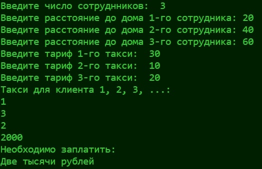
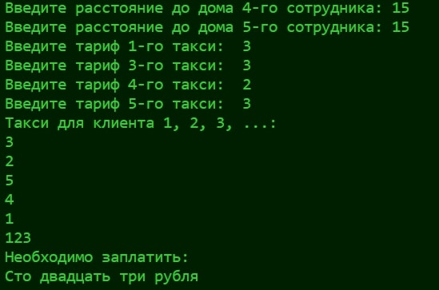

# Labz 6 🖥️
# Создатель 😎
Филиппов Кирилл Фт-220007
# Функционал программы 🔑
Директор фирмы решил заказать такси, чтобы развезти сотрудников по домам. Он заказал N машин — ровно столько, сколь у него сотрудников. У каждого водителя такси свой тариф за 1 километр. Директор знает, какому сотруднику сколько километров от работы до дома.
# Запуск программы 💪
Программа может быть открыта в любой среде.
Написана в VScode
# Тесты ☄️
Тест 1(❀❛ ֊ ❛„)♡
___

___
Тест 2(❀❛ ֊ ❛„)♡
___
